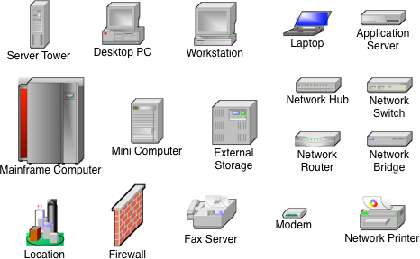

# Visio2000-BasicNetworkShapes3D
 Basic Network Shapes 3D stencils from Visio 2000 to PlantUML sprites.

 The VSS stencil to SVG/PNG conversion process has been documented [here](https://translate.google.com/translate?sl=pt&tl=en&hl=pt-BR&u=https://eduardomozartdeoliveira.wordpress.com/2023/01/30/instalacao-do-libvisio2svg-no-macos/).

 ## Samples



### Network Diagram


```csharp
@startuml

!define Visio2kNet https://raw.githubusercontent.com/eduardomozart/Visio2000-BasicNetworkShapes3D/main
!include Visio2kNet/puml/Server.puml
!include Visio2kNet/puml/Personal_computer.puml
!include Visio2kNet/puml/Laptop.puml

<style>
nwdiagDiagram {
  server {
    BackgroundColor none
    LineColor none
    
  }
}
</style>

nwdiag {
  fs01 [description = "<U+0020><U+0020><U+0020><U+0020><U+0020><U+0020><U+0020><U+0020><U+0020><U+0020><U+0020><U+0020><U+0020><U+0020><U+0020><U+0020><$Server>\nServidor: SRV01\nPasta comp. : C:\Manuais\nCaminho: \\\\SRV01\Manuais"]

  network LAN {
      fs01
      client01 [description = "<$Personal_computer>\n Cliente\n <U+0020><U+0020><U+0020><U+0020><U+0020>X:"]
      client02 [description = "<$Laptop>\n Cliente\n <U+0020><U+0020><U+0020><U+0020><U+0020>X:"]
      client03 [description = "<$Personal_computer>\n Cliente\n <U+0020><U+0020><U+0020><U+0020><U+0020>X:"]
      client04 [description = "<$Personal_computer>\n Cliente\n <U+0020><U+0020><U+0020><U+0020><U+0020>X:"]
      client05 [description = "<$Personal_computer>\n Cliente\n <U+0020><U+0020><U+0020><U+0020><U+0020>X:"]
  }
}
@enduml
```